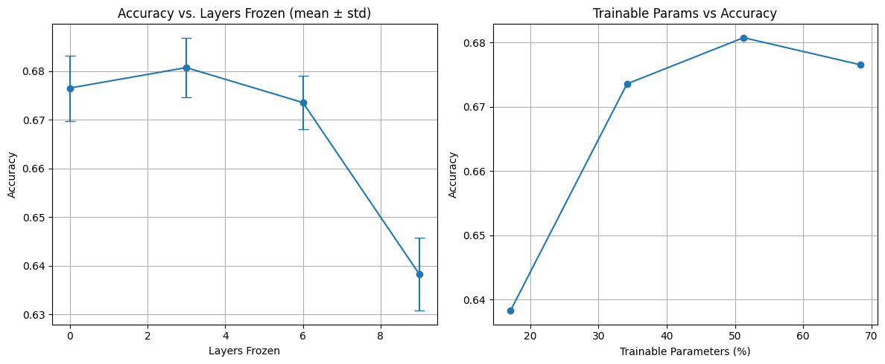

# My First Experiment: Probing Layer Predictions in Transformers

In my last post, [An Intuition About Transformers](https://aymanmahfuz27.github.io/principles-first-blog/#), I shared a framework that helped me finally understand how language models like ChatGPT might "build up" intelligence.  
The key idea was that **prediction forces compression, compression forces abstraction, and abstraction leads to emergent understanding**.

That framework felt intuitively right. But intuition alone isn’t enough — I wanted to see if I could **find any empirical hints** that this was actually happening inside real transformer models.

So, I decided to run a small experiment.  
Nothing fancy — I was working off minimal compute (just Google Colab) — but I figured that **even a rough first pass would teach me something**.

---

## The Experiment

The setup was simple:

- I took a small transformer model.
- At each layer, I attached a tiny linear head to predict the next token directly from that layer’s hidden state.
- Then I measured the prediction accuracy at each layer.

The idea was that if my intuition was right:

- Early layers, which are still working on low-level patterns, should do worse at next-token prediction.
- Deeper layers, having built up richer semantic abstractions, should do better.

**Simple hypothesis:**  
→ **Prediction accuracy should improve as we go deeper.**

---

## The Results

Here’s the graph from the experiment:

At first glance, the results were encouraging:

- **From Layer 0 to Layer 3**, prediction accuracy **increased very clearly**.
- It looked like deeper layers were indeed doing a better job at next-token prediction.

But then, something interesting happened:

- **After around Layer 3, the improvement plateaued.**
- Later layers didn’t keep getting significantly better — the curve flattened out.

---

## Interpreting the Results

The trend of increasing accuracy across the early layers aligns well with the initial hypothesis: as the model processes information, its internal representations become increasingly predictive of the next token.

However, after around **Layer 3**, the improvement begins to taper off.  
Rather than continuing to climb, the prediction accuracy plateaus, suggesting a shift in the model's internal behavior.

One possible interpretation is that the early layers focus on building **fundamental representations** — capturing local patterns, syntactic structures, and short-range dependencies that are directly useful for token prediction.  
Once these core abstractions are established — typically by the third layer — the marginal gains in direct prediction ability diminish.

Deeper layers likely begin to specialize in **more complex, global tasks**: maintaining coherence over longer contexts, managing ambiguity, planning future generations, and encoding more abstract semantic information.  
These tasks may be less immediately useful for direct next-token prediction in a linear sense, but are crucial for higher-quality generation overall.

Thus, while a simple linear probe can capture the growing predictive power in the early layers, it is likely insufficient to capture the richer, more distributed computations happening in the deeper layers.  
The plateau in accuracy is not necessarily a failure of deeper layers, but rather a reflection of **a transition in the model's priorities** — from local prediction to global organization.
---

## Reflections

This was my first time ever trying to bridge the gap between *an idea in my head* and *an experiment in the real world*. And it was a lot messier than I expected.

- I didn’t fine-tune hyperparameters aggressively.
- I only had access to limited compute (free Colab).
- The probe was simple, training was fast and rough — it wasn’t a "careful" paper-quality experiment.

Even though it’s not bulletproof, it **revealed a real signal**:  
the early layers of transformers seem to become progressively better at next-token prediction, until a transition point where deeper layers probably start specializing in more complex, global tasks.

That feels like a small but real validation of the intuition I wrote about:  
**prediction → compression → abstraction → understanding**.

---

## What's Next

There’s so much more I could do:

- Try larger models.
- Use better probes.
- Analyze multiple datasets.
- Look at how the representations themselves evolve, not just prediction accuracy.

But for now, I’m happy to share this first experiment.  
If you're curious about the code or want to dig into the results, you can check out the GitHub repo [here](https://github.com/AymanMahfuz27/layer-freezing-gpt-finetune/tree/main).

Thanks for reading — and if you’re thinking of running your first experiment too, my advice is: **just start**. You’ll learn more from the messiness than from endless planning.

