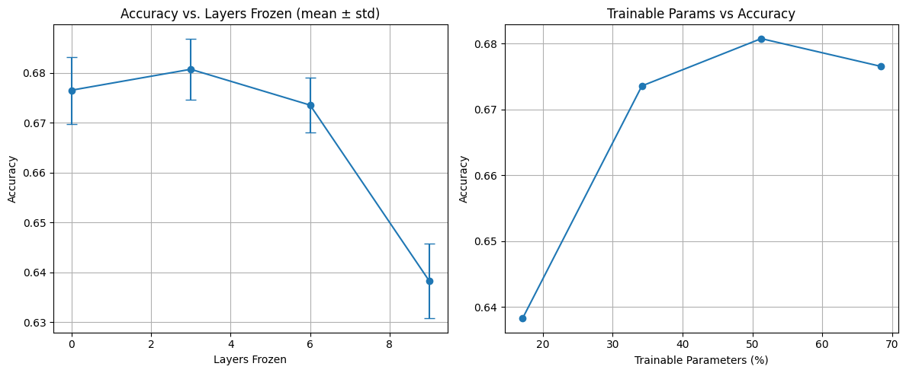

## From Intuition to Experiment: I Tried to Find the "Prediction Cascade" in a Real Transformer

In my last post, I laid out my "aha!" moment with transformers: the idea that the simple act of next-word prediction, when applied at massive scale, forces a model to build a hierarchy of understanding. In short: **prediction forces compression, compression forces abstraction, and abstraction leads to understanding.**

It’s a neat theory, but it’s just that—a theory. As a builder, I can't just leave an idea like that on the whiteboard. I had to see if I could find any evidence of it in the wild. So, I fired up a Google Colab notebook and ran my first-ever experiment to probe the guts of a real transformer.

My hypothesis was simple. If the layers are building on each other, then the model's ability to predict the next token should get better as we go deeper. An early layer, which is only seeing low-level patterns, should be pretty bad at guessing the final output. A deeper layer, which has access to more abstract and compressed information, should be much better.

**The simple hypothesis:** Prediction accuracy should climb with every layer.

### The Experiment: A Quick and Dirty Probe

The setup was about as simple as it gets. I took a small, off-the-shelf transformer and attached a tiny "probe" (a linear head) to the output of each layer. This probe's only job was to try and predict the next token based on the information available at its specific layer. Then, I ran some data through the model and measured how well each probe did.

### The Results: A Confirmation and a Plot Twist

Here’s the graph of what I found:

At first, I was thrilled. The graph showed exactly what I hoped to see. From Layer 0 to Layer 3, the accuracy climbs steadily. It was a clear signal that the deeper layers were, in fact, building a more predictive representation of the world. My "prediction cascade" theory was looking good!

But then, the plot twist. After Layer 3, the curve flattens out. The improvements in prediction accuracy screech to a halt. The deeper layers weren't getting any better at the simple, linear task of next-token prediction.

### What's Going On Here? My Interpretation

Did my theory fall apart after Layer 3? I don't think so. In fact, I think this plateau is even more interesting than a continuously climbing line. It suggests that the job of the layers *changes* as you go deeper.

My new hypothesis is this:

*   **The Early Layers (0-3) are the "Builders."** Their primary job is to take the raw token embeddings and build up the fundamental representations of language. They are forging the raw materials—capturing grammar, syntax, and short-range meaning. In this phase, every new layer directly contributes to a better, more predictive model of the text.

*   **The Deeper Layers (4+) are the "Orchestrators."** Once the foundational representations are built, the model's job shifts. The deeper layers are no longer just building; they are organizing. Their task is more complex and global. They are managing long-range dependencies, resolving ambiguity, maintaining a coherent narrative, and planning what to say next. Their work is less about predicting the very next word in a simple, linear fashion and more about ensuring the entire symphony of the output hangs together.

A simple linear probe is great at measuring the work of the Builders, but it's likely too simple to capture the sophisticated, non-linear work of the Orchestrators. The plateau doesn't mean the deeper layers are failing; it means they're playing a different, more advanced game.

### Reflections: The Joy of a Messy Experiment

This was my first time trying to bridge the gap between a blog post idea and a real-world experiment, and it was a fantastic, messy experience. My setup was far from perfect. I used a small model, I didn't fine-tune my probes extensively, and I was running on free Colab compute.

But even with all those caveats, I found a real signal in the noise. The results gave me a small but tangible piece of evidence that supports and refines my initial intuition. And that feels incredible.

It's a powerful reminder that you don't need a massive lab and a thousand GPUs to start testing your ideas. You just need a question, a bit of code, and the willingness to get your hands dirty.

### What's Next

This little experiment has opened up a dozen new questions for me. I want to try this on larger models, design more sophisticated probes, and analyze how the representations themselves evolve.

For now, I'm excited to share this first step. If you're curious, you can find the (admittedly messy) code and results in the GitHub repo [here](https://github.com/AymanMahfuz27/layer-freezing-gpt-finetune/tree/main).

If you're on the fence about running your own first experiment, take this as your sign. Just start. You'll learn more from the process than you can imagine.

