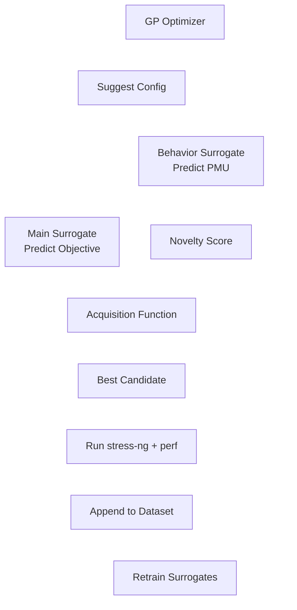

This summer at Arm, I tackled a project that sits at the intersection of hardware and machine learning: **using AI to break hardware (on purpose)**. More specifically, I built a pipeline that automatically finds ways to **maximally stress-test a computer’s hardware** using a tool called `stress-ng` – but with a smart twist. Why does this matter? In the era of hyperscale AI (think multi-trillion-parameter models running on massive GPU clusters), even rare hardware issues can become daily crises. I wanted to ensure that our systems can be pushed to their limits in a controlled way, to expose bottlenecks **before** they bite us in real production runs. This post is a technical yet casual walkthrough of what I built, why it’s needed, and how it works, step by step.

## The Challenge: Why Traditional Stress Testing Falls Short

Classic stress testing tools like **stress-ng** let you dial up various system workloads (CPU, memory, I/O, etc.), but there’s a catch. The parameters you feed into `stress-ng` are just a **request** for stress, not a guarantee. In practice, the relationship between a given stress-ng configuration and the actual hardware stress it produces is complicated and often non-linear. For example, on an 80-core machine, you might naively set `--cpu 80` expecting 100% utilization on all cores. In reality, some other bottleneck (memory bandwidth, OS scheduling, I/O, etc.) could cap effective usage at, say, 60 cores. In other words, simply maxing out all the stress knobs often **does not** yield maximum stress on the hardware. I saw this firsthand in my experiments – certain combinations of thread counts, memory operations, and other options would hit a wall due to one limiting resource, while other combinations achieved higher overall stress by balancing the load differently.

The key challenge, then, was **finding those “golden” combinations** of `stress-ng` flags that truly hammer a target subsystem (CPU, memory, etc.) to its actual limits. The search space is enormous – `stress-ng` has dozens of tunable parameters, and the optimal settings aren’t obvious. Brute force testing every combination isn’t feasible, because each test can take 30-60 seconds and there are virtually infinite possibilities. Even random sampling could miss the really extreme cases, as they might be rare needle-in-haystack scenarios. Clearly, a smarter approach was needed.

## My Approach: Let Machine Learning Find the Worst-Case Scenarios

I decided to treat this as a **black-box optimization** problem and bring in some machine learning to guide the search. The idea was to have the computer itself learn which `stress-ng` settings lead to the highest stress, instead of me guessing. Specifically, I built a pipeline that uses **Bayesian optimization** with a **Random Forest** surrogate model to navigate the space of stress test configurations intelligently.

Why Bayesian optimization? It’s perfect for scenarios where **each data point is expensive to get** (here, every stress-ng run takes time) and you have a **vast, weird search space with few extreme hotspots**. This describes our case exactly: we can only run a limited number of tests, and the really high-stress configurations (like those causing **billion page-faults per second** spikes) are extremely rare and hard to stumble upon by chance. Bayesian optimization is sample-efficient – it tries to find the optimum in as few runs as possible by carefully choosing each next test based on past results. The Random Forest model comes in as a surrogate to predict how stressful a given config will be, without having to actually run `stress-ng` each time. A Random Forest was chosen because our data can be noisy and non-linear (running the same test twice can give slightly different results due to background OS jitter, etc.), and ensemble methods like RF are robust to that noise. In short, the pipeline builds an ever-improving predictive model of "stress achieved" from "parameters given," and uses that model to pick new, promising test configurations to try next.

Another big part of the approach was **making the system hardware-aware and safe**. Since I was running this on real machines, I didn’t want the tool to, say, allocate more memory than the system had and crash it. So the pipeline **scans the host hardware and OS** limits first to understand the machine’s capabilities. We gather info like number of CPUs, total and free memory, supported CPU instruction sets, kernel parameters, etc. This becomes a hardware profile that we use to automatically set sensible bounds on the stress test parameters. For example, if the machine has 64 GB of RAM, the tool will ensure we don’t try to allocate 64 GB *per thread* or something crazy. It also enforces a global memory usage limit (a safety margin) so that the combined effect of all stressors stays within a safe percentage of available memory. This way, **every generated test configuration is valid and won't OOM or lock up the system** – a “safety first” design.

With the problem defined and the plan set, I went ahead and built the system. Here’s how the whole thing works, step by step:

## How It Works: Step-by-Step Pipeline Breakdown

**Hardware & OS Profiling:** The first step is introspection. I wrote a **hardware scanning module** that runs various system commands (like `lscpu`, `lsmem`, etc.) to gather details about the machine’s CPUs, memory, disks, network, and relevant OS limits. This produces a structured **hardware profile** (think of it as a JSON blob describing the system’s specs and limits). We use this to know, for instance, exactly how many cores are available, how much memory is free, what the max user addressable memory is, and other constraints. This ensures our stress test parameters will be **tailored to the machine** and not based on one-size-fits-all assumptions.

**Dynamic Parameter Space Generation:** Using the hardware profile, the next step is to auto-generate the **search space of stress test parameters**. Instead of hard-coding ranges, the tool programmatically defines what values each `stress-ng` parameter can take on this particular machine. For example, if there are 32 CPU cores, it will allow CPU stressor counts up to 32. If the machine has 128 GB of RAM but only 100 GB free, it might cap a memory allocator stressor to use at most, say, 80 GB. We also query the `stress-ng` tool itself for supported stress methods (because different versions of stress-ng have different options available). The output of this step is a comprehensive **parameter space definition** (saved as a JSON) that lists every tunable flag (CPU count, memory ops, I/O ops, etc.) along with its valid range or set of values. Importantly, we include a **global memory constraint** so that no combination of parameters will exceed safe memory usage – essentially a rule that prevents “too many heavy stressors at once.” At this point, we have a map of the landscape: all the possible (safe) ways we could configure stress-ng on this machine.

**Initial Data Collection (Sobol Seeding):** Now it’s time to actually run some stress tests and gather data. Rather than start with random picks, I used a **Sobol sequence** to generate a smarter set of initial configurations. Sobol sequences are a form of low-discrepancy sampling – in plain terms, it spreads out the sample points more uniformly across the high-dimensional parameter space than pure random sampling would. This gives the model a good diverse starting dataset covering different corners of the space. For each suggested config, the pipeline runs `stress-ng` with those parameters for a fixed duration (e.g. 30 seconds) and measures a bunch of performance metrics using Linux’s `perf` tool (things like CPU utilization, cache misses, page fault rate, context switches, thermal throttling events, etc.). Each test yields a data point: “Input (stress-ng flags) -> Output (observed hardware metrics).” We log all that, and then do some light **feature engineering** to extract meaningful features from raw data (for instance, computing rates like faults per second, etc., if not directly given). By the end of this phase, we have an initial dataset of stress-ng configs and their resulting performance.

## A Smarter Brain: Dual Surrogates and the RF → GP Pipeline

The core of the system is a **hybrid machine learning model** that learns how different `stress-ng` configurations actually affect hardware stress. But it’s not just one model — I built a **stacked dual-surrogate setup**, each part playing a different role in the optimization.

Here’s how it works:

### 1. **Main Surrogate (Objective Predictor)**

This model is a **Random Forest Regressor** trained to predict a scalar “objective score” (e.g., page fault rate) from a given stress-ng configuration. It forms the backbone of the search, enabling the system to rank and compare candidate configurations.

### 2. **Behavior Surrogate (PMU Predictor + Novelty Scorer)**

In parallel, I train a **second Random Forest**, but this one learns to predict the full **PMU (performance monitoring unit) vector** — all the low-level system events that a stress test triggers, like cache misses, context switches, faults, etc.

Then, I pass the predicted PMU vector through a **Behavioral Novelty Model**, which scores how "different" it is from all previously seen behavior. This is done by computing a z-scaled Euclidean distance to the nearest real observation. That distance becomes a **novelty score**, telling the optimizer how likely this config is to trigger a **new** kind of system behavior — useful for surfacing edge cases and avoiding local optima.

### 3. **The Hybrid Trick: Random Forest → Gaussian Process**

This is where things get weird — in a good way. While Random Forests are great for noisy data and nonlinear relationships, they're not smooth or differentiable, which makes them hard to optimize directly. To work around that, I do something unconventional:
I train the Random Forest, then **use a Gaussian Process (via `gp_minimize`) to optimize over its prediction surface**.

In essence:

* The **Random Forest** learns the noisy ground truth.
* The **Gaussian Process** learns to model the predictions of the Random Forest — a second-order model, if you will.
* The **Bayesian optimizer** then uses this GP model to explore the space of configurations more smoothly, while still grounded in the robustness of the forest.

This stacked design allows us to combine the **noise resilience of Random Forests** with the **sample efficiency and exploration capabilities of Gaussian Processes** — effectively giving us the best of both worlds.

Here’s the optimization loop as a visual:

This engine is what drives the entire optimization process. It proposes new stress configurations, scores them for both **expected pressure** and **behavioral novelty**, and continuously retrains itself on new data — evolving into a smarter and smarter test scheduler over time.

Throughout this process, everything is logged, and I included various diagnostics to make sure the search is behaving. For example, if the optimizer started suggesting something unsafe or out-of-bounds (which it shouldn’t, due to our validation checks), we’d catch it. But in my testing it remained within the safe envelope defined by the parameter space constraints.

## Results and Reflections

The outcome of this project was really exciting. Using this ML-guided approach, I was able to consistently find stress-ng configurations that produced **far higher stress on the hardware than any manual or random attempt** I tried before. For instance, when targeting memory page faults, the best config the optimizer found would generate page faults at a rate of around 346 faults per second, sustained. Interestingly, multiple different runs of the pipeline converged on that same ballpark (\~345–347 faults/sec), which told me we likely hit an actual **system limit** (e.g. the kernel or hardware simply can’t churn more faults than that on this machine) rather than just a lucky fluke. This consistency is a great validation that the method works – we weren’t fooled by random noise; we truly drove the system to its edge. In fact, empirical testing showed we reached the **practical performance limits of the current hardware**. Pushing further would require a more powerful machine or additional hardware, meaning the tool effectively maxed out what was possible in our environment.

Another satisfying result: the Bayesian optimizer proved very efficient. It managed to find near-optimal configs in only a modest number of iterations. In one experiment, the top configuration it found was in the **99.8th percentile of all tested configurations** in terms of the objective metric. And it did so while exploring only a tiny fraction of the huge parameter space, thanks to the intelligent search strategy. This is exactly what we hoped for – **far fewer tests needed** than brute force, yet ending up with an extreme stress scenario.

Along the way, I also improved the tooling itself. For example, I fixed a timing bug in our data collection script that was causing slight inconsistencies; after the fix, the measurements became a lot more reliable (going from "medium" to "high" confidence levels in my internal scoring). I also implemented some QoL features like an interactive CLI for the pipeline so you can choose objectives and see progress in real-time.

**Why does this matter?** On a practical level, this project provides a way to systematically uncover the *true* limits of a system’s performance. Instead of guessing or relying on vendor specs, we can generate evidence: “Here is a workload that makes component X the bottleneck, and here’s how far we can push it.” This can inform hardware design decisions, OS tuning, and where to focus engineering effort. For a company like OpenAI, which operates at extreme scale, such automated stress-discovery tools could be invaluable. When you’re running on thousands of GPUs and dozens of high-memory nodes, you want to know *beforehand* what the failure or throttling points might be. As discussed in the **OpenAI GPT-4.5** podcast, at large scales something is always bound to go wrong – rare failures become commonplace. My hope is that approaches like this ML-guided stress testing can serve as a kind of early warning system or optimization aid for those scenarios. It’s like doing **“crash tests” for computer systems** with an intelligent robot driver finding the worst ways to crash, so we can then reinforce those weak spots.

On a personal note, this project was a blast to work on. It pushed me to delve into low-level Linux performance monitoring, Bayesian hyperparameter search techniques, and the intricacies of `stress-ng`. I learned how to make disparate components (shell commands, Python ML libraries, OS tuning) work together in one pipeline. It was very rewarding to see the idea actually work in practice – watching the script suggest a crazy configuration that I’d never have tried myself, run it, and then seeing the metrics go **through the roof** was my GPT  moment.

Going forward, there are a few neat extensions that could make it even better. One is to fully automate the closed-loop optimization (right now I run a script that iteratively prompts; this could be hands-free with a proper controller). Another is to incorporate **multi-objective optimization** – sometimes you might want to maximize two things at once (e.g. maximize CPU usage while also generating high network traffic) or find trade-offs. Finally, building a small web dashboard to visualize the search in real-time would be useful, especially if others on the team want to monitor or interact with it easily.

In summary, I built an ML-guided stress testing framework that **finds the worst-case hardware stress scenarios automatically**. It’s a blend of low-level system hacking and high-level machine learning, and it showcases how AI techniques can help wrangle complex engineering problems like tuning a system to its limits. I’m excited about the potential impact of this work, and I’m eager to apply these ideas on even larger systems. After all, if this works for one machine, scaling it out to a data center or a cluster could be the next adventure – and I suspect there are plenty more bottlenecks waiting to be discovered and conquered.

Some other stuff I did at ARM: Gave a presentation on the history of deep learning to 30+ ML employees and enthusiasts within the company. We went from dismissed perceptrons to Solomonoff's Induction. I also learned how to swing a golf club.